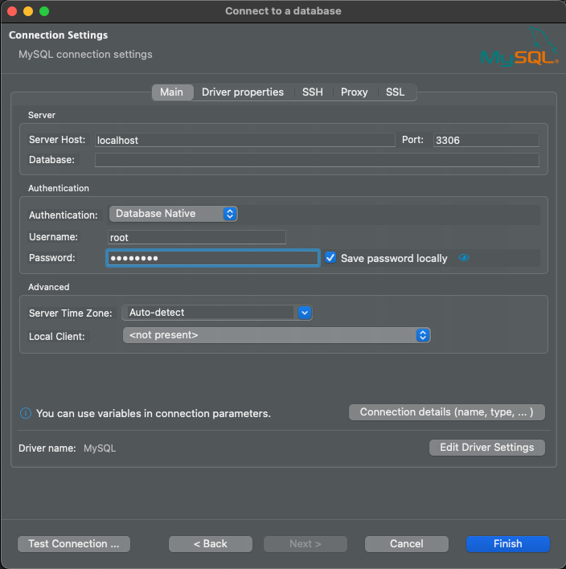

# Annual Permit Service
About the service, 
- The employee uses the annual permit to which he or she is entitled according to the length of worked each year.
- Annual permits must be approved by the admin before they can be used.
- If the annual permit is not approved, it is not deducted from the employee's annual permit period.
- The number of annual leave that the employee will be entitled to according to the period of work each year can be set in the application.yml file.
- Weekends (Saturday, Sunday) and public holidays are not counted as Permit.
- As soon as the service starts to work, it pulls the public holidays in Turkey from **https://api.ubilisim.com/resmitatiller/** and keeps it in its memory as a list.
- New employees can take up to 5 working days off as an advance. This application is valid for the first year only.
- Annual permit used new employees as an advance. Deducted from their annual permit days in the 1st year.
- When annual permit requests are created, they are in the status of `PENDING`, after admin approval.
  then it drops to `APPROVED` or `DENIED` status.
- This service supports Turkish and English language for messages to be displayed in API response and warning messages.

## Requirements
- [Java 8 JDK](https://www.oracle.com/tr/java/technologies/javase/javase8-archive-downloads.html)
- [Docker](https://www.docker.com/products/docker-desktop/)
- [Intellij IDE](https://www.jetbrains.com/idea/download/#section=mac) or any other favorite IDE
- [DBeaver](https://dbeaver.com/download/lite/) or any other database GUIs


## Setup
- Before run project you need to start docker desktop
- After docker is up, run the [docker-compose.yml](docker-compose/docker-compose.yml)
```
  docker-compose up -d
```
- After the run docker-compose.yml file you will see docker desktop like this: 

- Continue With DB Connection Part

## DB Connection
# Mysql Connection:


    url: jdbc:mysql://localhost:3306/annualPermit
    username: root
    password: password

* After you successfully connect database, you will see like this in DBeaver: 


# Running
- #### Run each project application file on your code ide.
- #### After you run application successfully you can check Mysql db on your GUI you have to see created 2 tables which names are `annual_permit` and `employee`


- #### Continue With Swagger Part
# Swagger
- #### While the Service is running, open the **http://localhost:8080/swagger-ui/index.html** on your browser. You will see like this:

# Things to pay attention
- #### In order to determine the language of API responses and warnings, it is mandatory to send the `lang` value as a parameter to the API.
- #### You must create an employee with `/api/v1/employee/create` api before requesting annual permit.
- #### Note the following when requesting annual leave with the `/api/v1/annual/permit/request` api:
  - #### If the employee has a pending approval annual permit request, cannot create a new one.
  - #### startDate and endDate must be in the format dd.mm.yyyy
  - #### endDate can not be equal the startDate
  - #### endDate can not be earlier than the startDate 
  - #### startDate can not be earlier than the today.
  - #### endDate must be earlier than the last day of the annual permit period.
  - #### If the requested date range for annual permit is within the public holiday or the weekend, the request can not be created.
  - #### If the employee has no available days for annual permit, an error message will be returned containing the start date of the next annual permit period.
  - #### If the number of days that the employee annual permit requested is greater than the number of available days, an error message containing the number of available days is returned.


